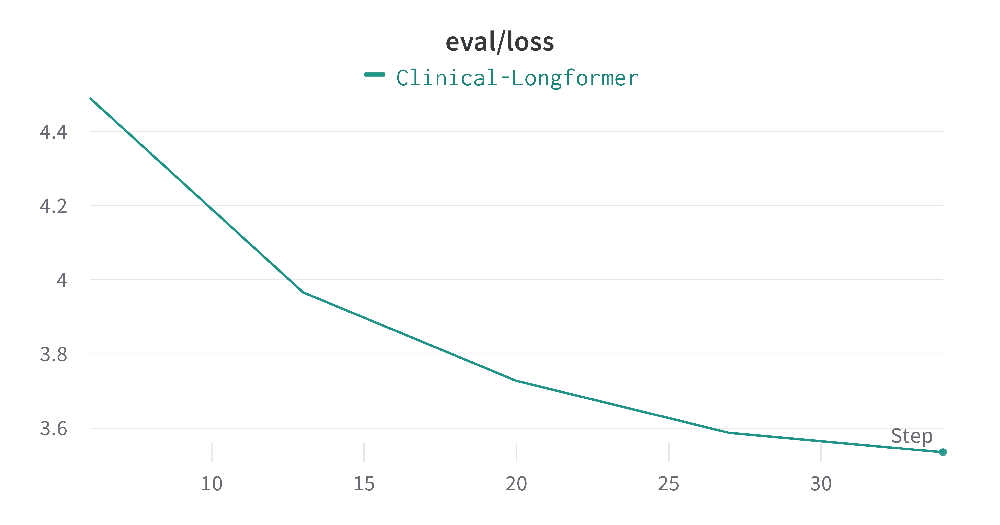

# Introduction {#sec:introduction}

# Related Work {#sec:related-work}

# Methods and Datasets {#sec:methods}

## Dataset {#sec:dataset}

The data we used is sourced from biomedical research articles in English published in the Public Library of Science (PLOS) and eLife [@goldsack]. 
The datasets (Tables \ref{tab:dataset_stats_1} and \ref{tab:dataset_stats_2}) contain technical abstracts and lay summaries written by experts, which are part of BioLaySumm2023 shared task [@biolaysumm-2023-overview].

\begin{table}[htbp]
    \centering
    \begin{tabular}{c||c|c}
        \hline
        \textbf{Dataset} & \textbf{Training} & \textbf{Validation} \\
        \hline
            PLOS & $24,773$ & $1,376$ \\
        \hline
            eLife & $4,346$ & $241$ \\
        \hline
    \end{tabular}
    \caption{PLOS and eLife: number of articles}\label{tab:dataset_stats_1}
\end{table}

\begin{table}[htbp]
    \centering
    \begin{tabular}{c||c|c}
        \hline
        \textbf{Dataset} & \textbf{Avg. Sentences} & \textbf{Avg. Tokens} \\
        \hline
            PLOS & $300$ & $9,000$ \\
        \hline
            eLife & $600$ & $14,000$ \\
        \hline
    \end{tabular}
    \caption{PLOS and eLife: Dataset statistics}\label{tab:dataset_stats_2}
\end{table}

## Extractor Network {#sec:extractor-network}

Due to the extreme length of medical articles (e.g., eLife has an average of 600 sentences per article), 
it is not feasible to pass them directly as input to the abstractive models due to their limited maximum input size:

i. **GPT-2** [@radford2019language]: $1,024$ tokens, and
ii. **Clinical-Longformer** [@li2023comparative]: $4,096$ tokens

To overcome this limitation, we use the BioClinicalBERT [@alsentzer-etal-2019-publicly] model, pre-trained on the MIMIC-III dataset [@Johnson2016MIMICIII],
to extract the most important sentences from the articles.
For that purpose, we cast the extraction summarisation problem as supervised binary classification where the input is a sentence $s$ 
and the output is a binary label indicating whether the sentence should be included in the summary $c$ or not (i.e., 1 and 0, respectively).
Due to the nature of the provided gold summaries (i.e., abstractive and lay), we generate our own sentence-level 
dataset by applying the ROUGE-maximisation technique [@zmandar-etal-2021-joint;@nallapati2017summarunner] on the gold summaries and the whole articles. 
More formally, for each gold summary sentence $s_{i}^{k}$, we find the sentence $s_{j}^{k}$ in article $a_{k}$ that maximises the ROUGE-2 score between them.
We then label $s_{j}^{k}$ as 1 and the rest of the sentences in $a_{k}$ as 0.
Because the number of sentences in the articles is much larger than the number of sentences in the gold summaries:

i. We base our extractive binary dataset on both eLife and PLOS data to maximise the number of training samples;
ii. We further resolve the class imbalance problem by random under-sampling the majority class (i.e., $0$) 
          to match the number of samples in the minority class (i.e., $1$);

Our final extractive dataset consists of $944,234$ sentences with a completely balanced class distribution.
Data is further split into $80%$-training, $10%$-validation and $10%$-testing datasets in a random stratified manner.
We then fine-tune the extractive model with a batch size of $32$ and a learning rate of $2e-5$ following the guidance from 
BERT's authors [@Devlin2019BERTPO] and find that the model starts to over-fit beyond $2$ epochs 
(see Figures \ref{fig:extractor-eval-f1} and \ref{fig:extractor-eval-loss}).
We also report high F1 scores of $0.767$ and $0.765$ on the validation and test sets, respectively.

\begin{figure}
    \centering
    \includegraphics[width=0.5\textwidth]{charts/extractor-eval-f1.png}
    \caption{BioClinicalBERT: Evaluation F1}\label{fig:extractor-eval-f1}
    \vspace{0.25cm}
    \includegraphics[width=0.5\textwidth]{charts/extractor-eval-loss.png}
    \caption{BioClinicalBERT: Evaluation Loss}\label{fig:extractor-eval-loss}
\end{figure}

We then use the BioClinicalBERT model to predict the probability of each sentence in the article being _summarising_.
The top $10$ sentences with the highest probability are selected and concatenated to produce the final extractive summary.
While we are aware that this can cause the _dangling anaphora phenomenon_ [@lin2009summarization], we use the 
extracted text only as an intermediate step fed into the abstractive models which paraphrase it into lay language.

## Abstractive Network {#sec:abstractive-network}

Once the extractive summary is generated, we train the abstractive models on the lay summaries and the extractive summaries. For this, we compare two models: GPT-2 [@radford2019language] and Clinical-Longformer [@li2022clinicallongformer]. 
We fine tune both models separately on eLife and PLOS. This is done due to the difference in structure and the average number of tokens in the lay summaries between the two datasets (i.e., $450$ and $800$ for PLOS and eLife, respectively).
Hyperparameters are set based on widely used values in the literature [@li2022clinicallongformer;@radford2019language;@Devlin2019BERTPO]. 

### Clinical Longformer Abstractor {#sec:clinical-longformer-abstractor}
The Clinical Longformer [@li2023comparative] is a transformer-based model that is pre-trained on the MIMIC-III dataset [@Johnson2016MIMICIII]
and we fine-tune it as a sequence-to-sequence task on (a) the gold lay summaries and (b) the ROUGE-maximising 
training data described in Section \ref{sec:extractor-network}.
\begin{figure}
    \centering
    \includegraphics[width=0.5\textwidth]{charts/token_distribution}
    \caption{Token Distribution of Extracted Summaries}\label{fig:abstractor-eval-rouge}
\end{figure}

For the Longformer model, we experimented with window, batch, and input size to ensure that we would not run out of memory during training, as this is a common issue with Longformer models.
We found that a window size of $64$, batch size of $2$, and input size of $1024$ worked best for our dataset.

### GPT-2 Abstractor {#sec:gpt2-abstractor}

The GPT-2 is an autoregressive language model that was trained using a casual language modeling objective [@radford_wu]. Given its extensive exposure to diverse text sources and natural language patterns, we hypothesize that GPT-2 would be particularly adept at generating lay summaries, making it a promising candidate for the abstractive summarization task. To fine-tune GPT-2 for this purpose, we utilize a "TL;DR" prompt, instructing the model to generate concise and informative summaries.

Similar to the Longformer, we train GPT-2 on both eLife and PLOS datasets, adopting most hyperparameters from the existing literature to ensure optimal performance. Since GPT-2 can accommodate a total of 1024 tokens, we experimented with various splits between the number of tokens allocated for the extracted summary and the lay summary. Through experimentation, we determined that allocating 507 tokens for the article and 512 tokens for the summary, with 5 reserved for the "TL;DR" prompt, yielded the best results in terms of summary quality and model performance. The evaluation loss decrease during the fine-tuning process is illustrated in Figure \ref{fig:gpt-eval}.

\begin{figure}
    \centering
    \includegraphics[width=0.49\textwidth]{charts/gpt_eval_loss}
    \caption{GPT 2 Evaluation Loss}\label{fig:gpt-eval}
\end{figure}

In the evaluation phase, we compared the performance of the GPT-2 Abstractor against the Clinical Longformer Abstractor, as well as other summarization models. The results indicate that both models have their strengths and weaknesses, which we will discuss in further detail in the following sections.

# Evaluation {#sec:evaluation}

\begin{table*}[htbp]
    \centering
    \begin{tabular}{|c|c|c|c|c|c|c|}
        \hline
        \textbf{Model} & \textbf{Rouge1} & \textbf{Rouge2} & \textbf{RougeL} & \textbf{FKGL} & \textbf{ARI} & \textbf{Gunning} \\
        \hline
            Lexrank & $0.334$ & $0.085$ & $0.164$ & $33.59$ & $15.41$ & $18.50$ \\
        \hline
            Extractive & $0.329$ & $0.0998$ & $0.163$ & $10.6$ & $25.01$  & $26.22$ \\
        \hline
            GPT2 & $0$ & $0$ & $0$ & $0$ & $0$ & $0$ \\
        \hline
            Longformer & $0.289$ & $0.062$ & $0.143$ & $27.33$ & $16.89$ & $18.44$ \\
        \hline
    \end{tabular}
    \caption{ROUGE and readability statistics.}\label{tab:dataset_stats}
\end{table*}

# Discussion and Conclusion {#sec:discussion-conclusion}

# Bibliography
